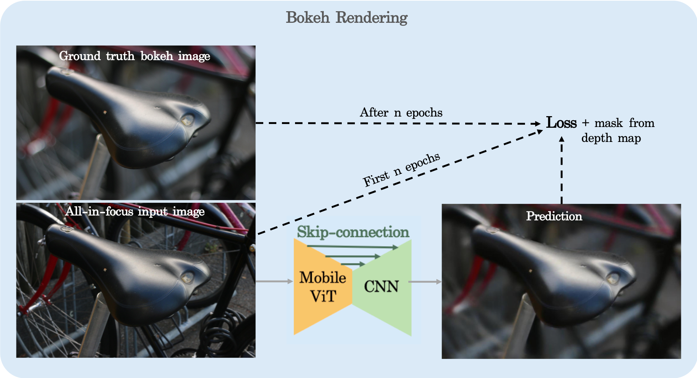
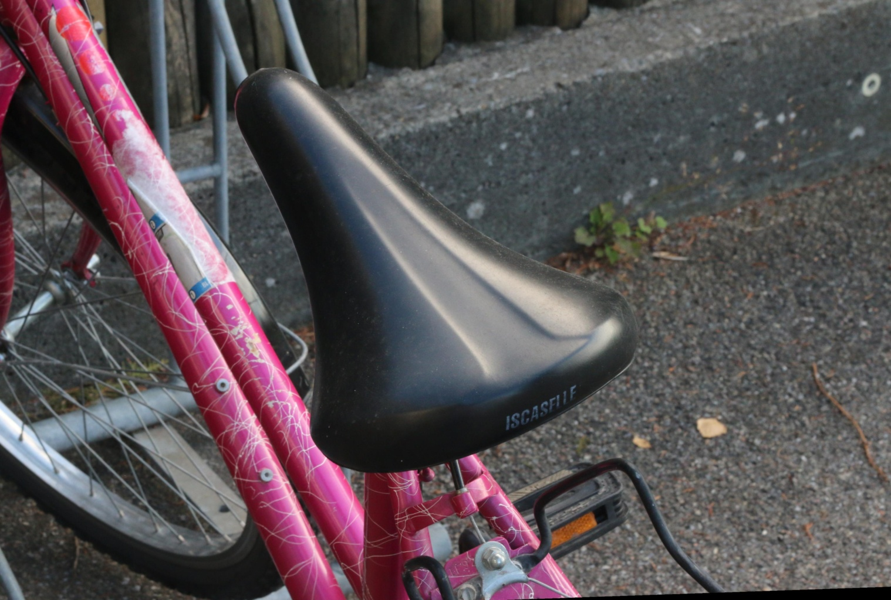
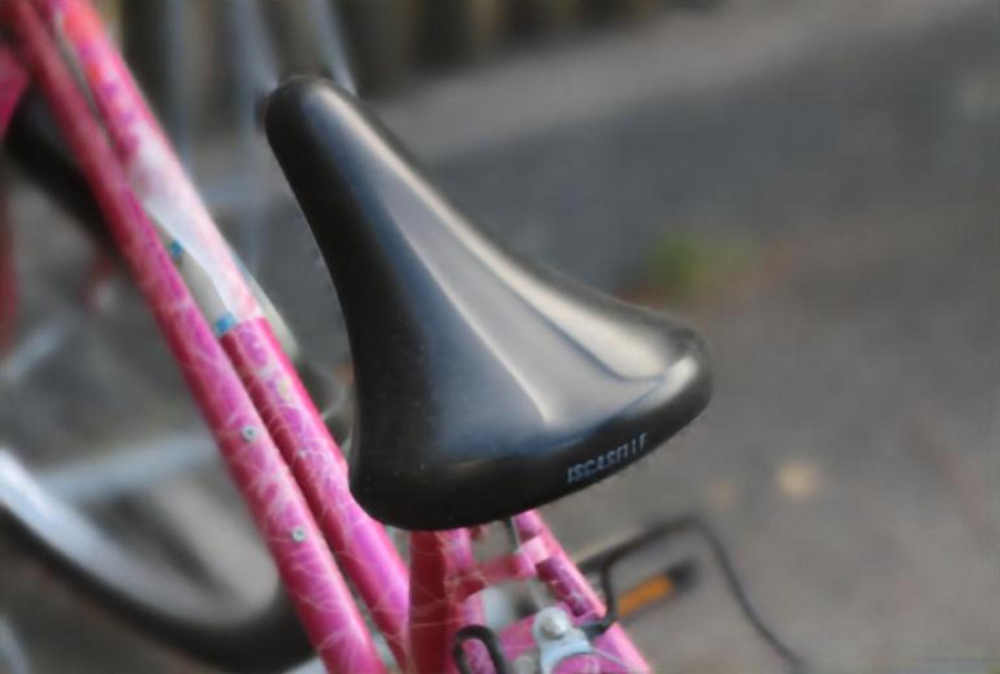
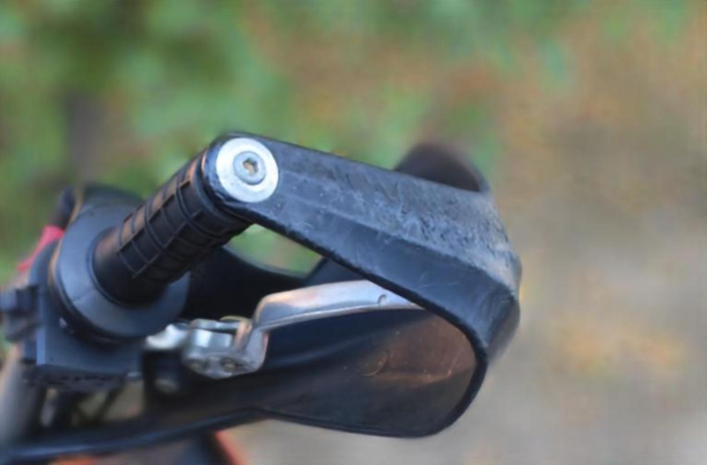

# Realistic Bokeh Effect Rendering on Mobile GPUs

This repository contains the source code for bokeh rendering with mobilevit encoder and cnn decoder. 
EBB! is the train dataset which be provided from ECCV challenge.

I cloned a repository from someone else's GitHub, made changes, and then pushed the modified code to my GitHub. &rarr;
<a href="https://github.com/apple/ml-cvnets" target="_blank">Apple: CVnets</a>

If you want to know how to use a model, how to get the model ckpts, please reference above link.


# network
 


# Result
input, output


  
  

# Additional Guide

## Training the model
To train with MobileViTv2(256*256): MobileViTv2-1.0 model weights, 
```
export CFG_FILE=config/bokeh/bokeh_mobilevitv2.yaml
export MODEL_WEIGHTS=weights/mobilevitv2-1.0.pt
PYTHONWARNINGS="ignore" cvnets-train --common.config-file $CFG_FILE --common.results-loc mobilevitv2_results --common.override-kwargs model.classification.pretrained=$MODEL_WEIGHTS
```
* in durint_training folder, some predicted images will be saved in each epoch. 
* in mobilevitv2_results folder, the pt files will be saved.

```
export CFG_FILE=config/bokeh/bokeh_mobilevitv2.yaml
export MODEL_WEIGHTS=mobilevitv2_results/try_1/30epoch/checkpoint_last.pt
PYTHONWARNINGS="ignore" cvnets-train --common.config-file $CFG_FILE --common.results-loc mobilevitv2_results --common.override-kwargs model.bokeh.pretrained=$MODEL_WEIGHTS
```

* To modifying the loss function,  to engine/training_engine.py. When do self.criteria(=msssim), the results will be very strange. (like black or white image)

When using mobilevitv2-1.0.pt, the size of the features in cvnets/models/bokeh/head/base_bok_head.py is ...
```
torch.Size([4, 128, 128, 192])
torch.Size([4, 256, 64, 96])
torch.Size([4, 384, 32, 48])
torch.Size([4, 512, 32, 48])
-------------------------
torch.Size([4, 128, 128, 192])
torch.Size([4, 128, 64, 96])
torch.Size([4, 128, 32, 48])
torch.Size([4, 128, 32, 48])
--------------------------
torch.Size([4, 128, 32, 48])
torch.Size([4, 128, 64, 96])
torch.Size([4, 128, 128, 192])
torch.Size([4, 128, 256, 384])
output = torch.Size([4, 3, 512, 768])
```


## DOCKER Guide 

<a href="https://github.com/codalab/codalab-competitions/wiki/User_Docker" target="_blank">Coda Repo</a>

Connect to the server.
```
ssh user@ip address
docker ps
```
If docker is installed, and docker images are in the server, you can check the container ID.
```
CONTAINER ID   IMAGE                    COMMAND       CREATED          STATUS          PORTS     NAMES
bbcd3d19bbfc   codalab/codalab-legacy   "/bin/bash"   20 minutes ago   Up 20 minutes             goofy_lederberg
```

To access containter, 
```
docker exec -it -u root bbcd3d19bbfc bash
```

You have to create the folder and save model & evaluation code. 
After doing this, 'exit' the container. 

You have to upload the image to docker server.
You can customize [tag] ex) 'try_01'
```
docker commit bbcd3d19bbfc hyebiny/codalab:[tag]
docker push hyebiny/codalab:[tag]
```

END!


## License

For cvnets license details, see [LICENSE](LICENSE). 

## Citation

Citations of the Bokeh Challenge paper in ECCV 2022:

``` 
@inproceedings{ignatov2022realistic,
  title={Realistic bokeh effect rendering on mobile GPUs, mobile AI \& AIM 2022 challenge: report},
  author={Ignatov, Andrey and Timofte, Radu and Zhang, Jin and Zhang, Feng and Yu, Gaocheng and Ma, Zhe and Wang, Hongbin and Kwon, Minsu and Qian, Haotian and Tong, Wentao and others},
  booktitle={European Conference on Computer Vision},
  pages={153--173},
  year={2022},
  organization={Springer}
}
```